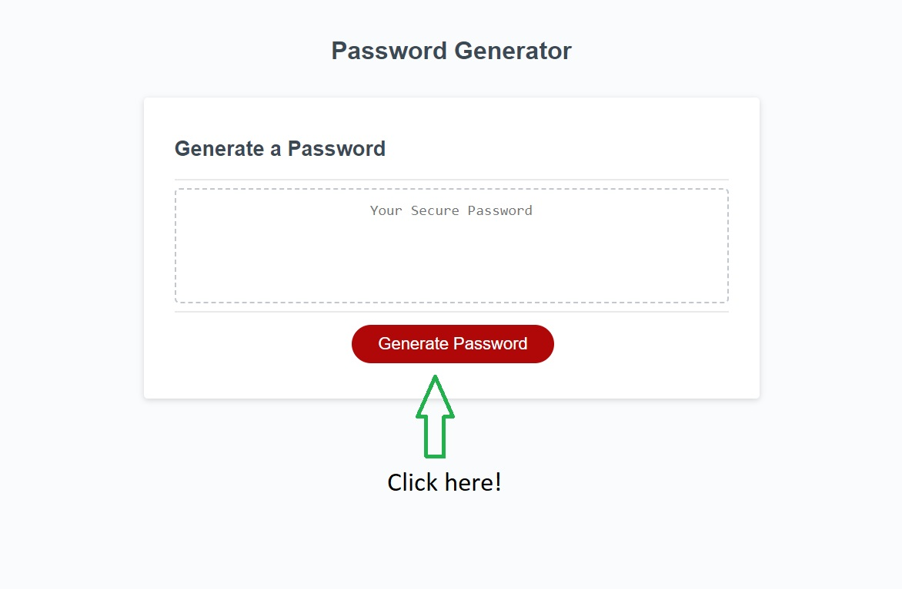
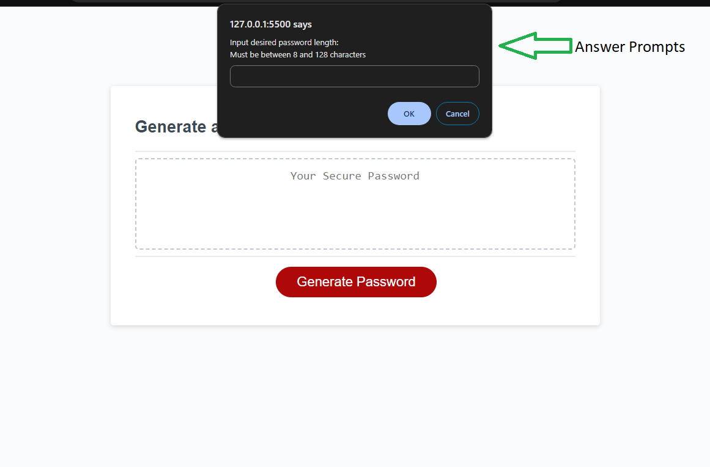
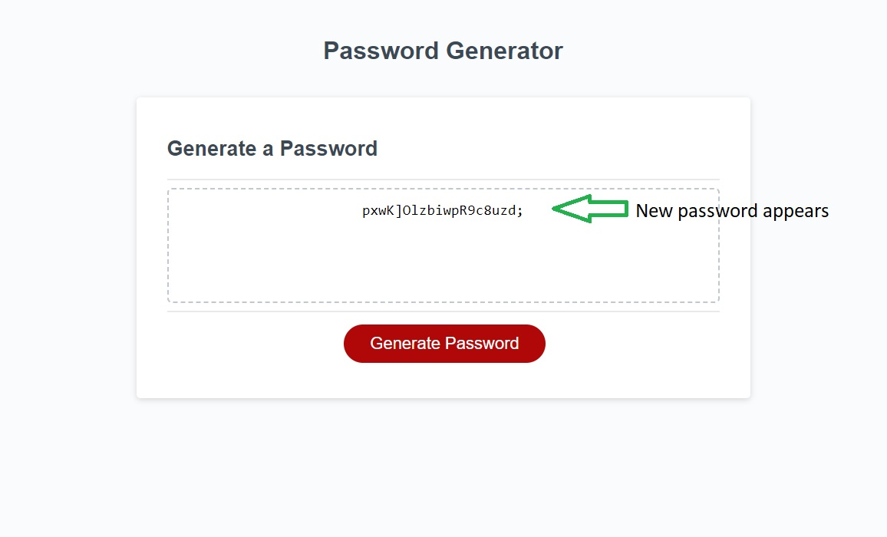

# Password Generator

## Description

The main goal of this application was to provide users with the ability to generate a strong, pseudo-random password based on certain criteria. As time goes on, cybersecurity is ever-increasingly important to keep in mind in order to keep your sensitive information safe. Sometimes coming up with a strong password is challenging, and I hope this application can help! **Important Note:** This application utilizes `Math.random()` to randomly pick characters. Per MDN Web Docs guidelines, this will not provide a cryptographically secure random selection. Use this application with discretion.

The application features a simple interface for ease of use; after selecting the "Generate Password" button, users will go through prompts to determine characteristics and criteria for their new password, and the new password will appear in the main box labeled "Your Secure Password."

While completing this project/application, my knowledge about JavaScript was put to the test. I learned how to properly utilize arrays, different array methods (concat, join, push), object methods, conditional statements, and variables within different scopes.

## Installation

N/A

## Usage

To use this application, please use [this link](https://ajprobel.github.io/password-generator/)

Once on the page, click the button labeled "Generate Password."
Once the button is selected, a series of window prompts appear in the browser:
* For the first prompt asking about the desired length of the password, please enter a numeric value between 8 and 128
* For the following prompts, please answer "yes" or "no" for each inquiry about lowercase characters, uppercase characters, numbers, and special characters
After answering all of the prompts, a new, randomly generated password will appear in the box.

See screenshots below:

## Credits

This application was created from starter code provided by the Programming Bootcamp - UNC Chapel Hill (HTML and CSS).

Functionality/JavaScript designed by me, James Probel, with guidelines provided by the Programming Bootcamp - UNC Chapel Hill.

Credit to Gael Thomas for direction on converting array elements to strings without commas - https://dev.to/gaelgthomas/array-to-string-without-commas-in-javascript-4mg6

Thank you to MDN Web Docs for guidelines on `Math` methods, array methods, and window prompts - 
https://developer.mozilla.org/en-US/docs/Web/JavaScript/Reference/Global_Objects/Math
https://developer.mozilla.org/en-US/docs/Web/JavaScript/Reference/Global_Objects/Array/concat
https://developer.mozilla.org/en-US/docs/Web/JavaScript/Reference/Global_Objects/Array/push
https://developer.mozilla.org/en-US/docs/Web/JavaScript/Reference/Global_Objects/Array/join

## License

The last section of a high-quality README file is the license. This lets other developers know what they can and cannot do with your project. If you need help choosing a license, refer to [https://choosealicense.com/](https://choosealicense.com/).
